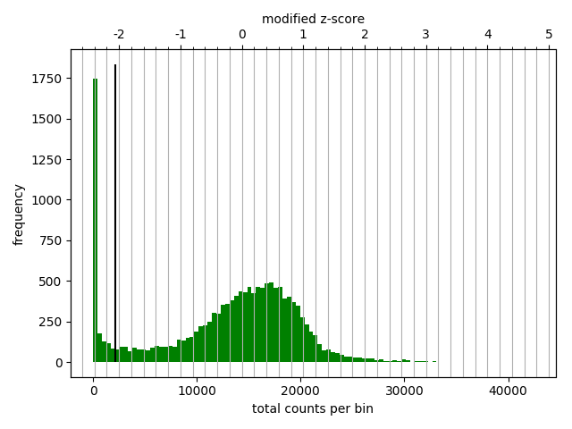
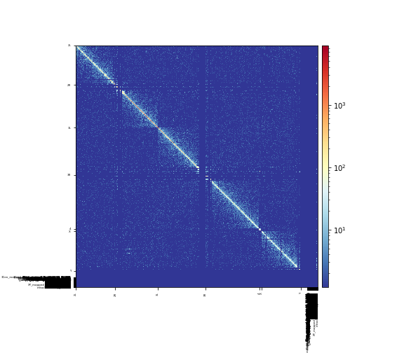

COSMOS Project
===================

----

## Ryan Pellow ##

Fidel Ramírez, Vivek Bhardwaj, Laura Arrigoni, Kin Chung Lam, Björn A. Grüning, José Villaveces, Bianca Habermann, Asifa Akhtar, and Thomas Manke. "High-resolution TADs reveal DNA sequences underlying genome organization in flies" Nature Communications, January, 15 2018, https://www.nature.com/articles/s41467-017-02525-w

Figure 1: Figure I'm going to replicate.

Figure 2: Diagram of Hi-C protocol

Sergey Ulianov, Alexey A Gavrilov, and Sergey V Razin. "Nuclear Compartments, Genome Folding, and Enhancer-Promoter Communication International review of cell and molecular biology, February 2018, DOI: 10.1016/bs.ircmb.2014.11.004

## Introduction ##

Understanding the organization of chromosomes provides insights into the regulation of genome function. Recently, the development of Hi-C allowed for the ability to study the contacts within and between chromosomes. These contacts, emphasized in Figure 2, are seen as insulator proteins (the light blue blobs) mediating DNA-DNA interactions (the red chromosome with the blue chromosome). In brief, Hi-C crosslinks DNA interactions, creates fragments via restriction enzymes, then ligates close by strands, which are subsequently sequenced to produce contacts (Figure 2). It is important to make clear that a successful contacts consists of sequences from two sections of the genome. Additionally, looking back at Figure 1, the darker shade of blue signifies more copies of that pair. This explains the overall triangle aspect, which represents chromosome subcompartments or topologically associated domains (TADs). The bottom corners of the TADs describe the location of an insulator protein (usually a hallmark of a TAD boundary), whose sequence will most likely not be cut and ligated with anything and thus the reads map only to its location. Also, a dark triangle represents an ordinary domain, whereas the darkening of only the top tip of the triangle represents a loop domain. As a clarification, TADs are broadly defined as they may contain both smaller TADs and loops. Significantly, TADs have been able to show the congregation of coregulated genes, as well as the interactions between genes and distal regulatory elements. The paper I chose sought to describe the DNA motifs that are enriched at the TAD boundaries, which by doing so would identify common insulator motifs. Note that when looking at the figure, the areas of low TAD-separation score, strive to further define a TAD boundary. When this is compounded with ChIP-seq data, the presence of the insulator protein Beaf32 and its cofactor CP190 are exemplified as expected. Interestingly, proposed insulator protein Su(Hw) had little coverage, while known mammalian insulator protein CTCF had no coverage. Finally, the paper performed ChIP-seq to demarcate between heterochromatic (H3K27me3) and euchromatic (H3K36me3, H3K16ac, H3K4me1) regions. The purpose behind choosing this paper was to use it as a proof of concept as my project in lab seeks to create similar figures to describe the effect of stress on TADs.

## Methods ##

### Hi-C Processing ###

The Hi-C data was downloaded from NCBI under the accession SRR3452738 using the fastq-dump --split-3 to seperate forward and reverse reads into two seperate 
files. To align the Hi-C data, bwa mem was used with a relaxed gap extension penalty (-E 50) and no clipping penalties (-L 0) in order to allow reads to map 
to distant regions in the genome. From there, HiCEplorer and co-required packages were downloaded using pip install in a virtual environment on the argon high
 performance cluster. This allowed for the bypass of root administration requirements. Subsequently the output .bam files from alignment were processed into 
.cool file using "hicBuildMatrix" with various binsizes (will hopefully be based on restriction site in later commits, there appears to be a bug, 
in the program [broken parameter](https://github.com/deeptools/HiCExplorer/issues/361)), which accesses the initial contacts and provides quality control 
(images can be seen in qcfolder, but are hidden on github due to the high resolution and consequently large file size). The .cool file was then diagnosed 
using "hicCorrectMatrix dianostic_plot" (Figure 3). Based on the diagnostics, a threshold of was chosen for the "hicCorrectMatrix correct" command, which 
outputed a corrected .cool file that was then plotted using "hicPlotMatrix" (Figure 4). Finally, in order to call TADs, "hicFindTADs" was used to ouput .bed
files containing boundary, domain and TAD seperation scores information. These were then used to build plots via make_tracks_file (from pyGenomeTracks) and 
hicPlotTADs. Below you will see a merged plot of of TADs similar to my goal, with varying resolution (Figure 5).

### ChIP-seq Processing ###

The ChIP-seq data had been located with various accession numbers, however I have not gotten around to actually downloading. They are in the form of .bed and
.wig files, which as the article lets on, were aligned using Bowtie2 dm3, with peaks being identified by MACS2 and motifs recognized by MEME-chip. Finally, 
after processing they will be merged with the Hi-C data using "hicPlotTADs".

Figure 3: Diagnostic Plot.

Figure 4: Test Matrix.

Figure 5: TADs Plot.

