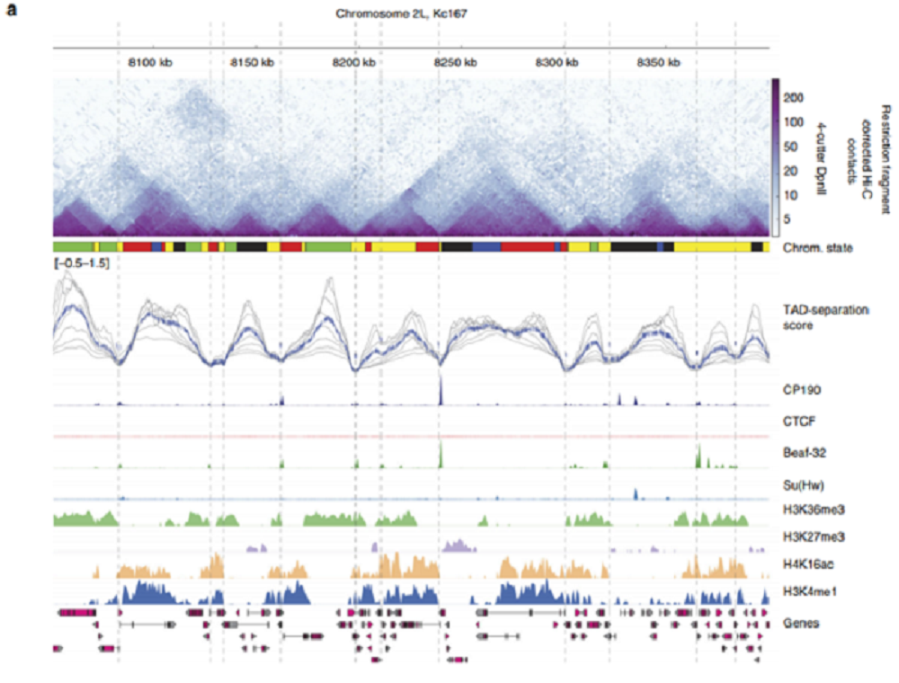

COSMOS Project
===================

----

## Ryan Pellow ##

Fidel Ramírez, Vivek Bhardwaj, Laura Arrigoni, Kin Chung Lam, Björn A. Grüning, José Villaveces, Bianca Habermann, Asifa Akhtar, and Thomas Manke. "High-resolution TADs reveal DNA sequences underlying genome organization in flies" Nature Communications, January, 15 2018, https://www.nature.com/articles/s41467-017-02525-w

Figure 1: Figure I'm going to replicate.

Figure 2: Diagram of Hi-C protocol

Sergey Ulianov, Alexey A Gavrilov, and Sergey V Razin. "Nuclear Compartments, Genome Folding, and Enhancer-Promoter Communication International review of cell and molecular biology, February 2018, DOI: 10.1016/bs.ircmb.2014.11.004

## Introduction ##

Understanding the organization of chromosomes provides insights into the regulation of genome function. Recently, the development of Hi-C allowed for the 
ability to study the contacts within and between chromosomes. These contacts, emphasized in Figure 2, are seen as insulator proteins (the light blue blobs) 
mediating DNA-DNA interactions (the red chromosome with the blue chromosome). In brief, Hi-C crosslinks DNA interactions, creates fragments via restriction 
enzymes, then ligates close by strands, which are subsequently sequenced to produce contacts (Figure 2). It is important to make clear that a successful 
contacts consists of sequences from two sections of the genome. Additionally, looking back at Figure 1, the darker shade of blue signifies more copies of that
pair. This explains the overall triangle aspect, which represents chromosome subcompartments or topologically associated domains (TADs). The bottom corners of
the TADs describe the location of an insulator protein (usually a hallmark of a TAD boundary), whose sequence will most likely not be cut and ligated with 
anything and thus the reads map only to its location. Also, a dark triangle represents an ordinary domain, whereas the darkening of only the top tip of the 
triangle represents a loop domain. As a clarification, TADs are broadly defined as they may contain both smaller TADs and loops. Significantly, TADs have been
able to show the congregation of coregulated genes, as well as the interactions between genes and distal regulatory elements. The paper I chose sought to 
describe the DNA motifs that are enriched at the TAD boundaries, which by doing so would identify common insulator motifs. Note that when looking at the 
figure, the areas of low TAD-separation score, strive to further define a TAD boundary. When this is compounded with ChIP-seq data, the presence of the 
insulator protein Beaf32 and its cofactor CP190 are exemplified as expected. Interestingly, proposed insulator protein Su(Hw) had little coverage, while known
mammalian insulator protein CTCF had no coverage. Finally, the paper performed ChIP-seq to demarcate between heterochromatic (H3K27me3) and euchromatic 
(H3K36me3, H3K16ac, H3K4me1) regions. The purpose behind choosing this paper was to use it as a proof of concept, as my project seeks to create similar
figures to describe the effect of stress on TADs.

## Methods ##

### Hi-C Processing ###

The Hi-C data was downloaded from NCBI under the accession SRR3452738 using the fastq-dump --split-3 to seperate forward and reverse reads into two seperate 
files. To align the Hi-C data, bwa mem was used with a relaxed gap extension penalty (-E 50) and no clipping penalties (-L 0) in order to allow reads to map 
to distant regions in the genome. From there, HiCEplorer and co-required packages were downloaded using pip install in a virtual environment on the argon high
 performance cluster. This allowed for the bypass of root administration requirements. Subsequently the output .bam files from alignment were processed into a
.cool file using "hicBuildMatrix" with various binsizes (dpnII restriction fragment, 1kb, 5kb, 10kb), which accesses the initial contacts and provides quality
 control (images can be seen in qcfolder, but are hidden on github due to the high resolution and consequently large file size). The .cool file was then 
diagnosed using "hicCorrectMatrix dianostic_plot" (Figure 3). Based on the diagnostics, a threshold of was chosen for the "hicCorrectMatrix correct" command, 
which outputed a corrected .cool file that was then plotted using "hicPlotMatrix" (Figure 4). Finally, in order to call TADs, "hicFindTADs" was used to ouput 
.bed files containing boundary, domain and TAD seperation scores information. These were then used to build plots via "make_tracks_file" (from pyGenomeTracks
and "hicPlotTADs". Ultimately, the last challenge will be to find more in-depth documentation for pyGenomeTracks and since the article fails to list their 
parameters, there might be quite a bit of time spent exploring and tinkering.

### ChIP-seq Processing ###

The ChIP-seq data had been located with various accession numbers, however I have not gotten around to actually downloading. They are in the form of .bed and
.wig files, which as the article lets on, were aligned using Bowtie2 dm3, with peaks being identified by MACS2 and motifs recognized by MEME-chip. Finally, 
after processing they will be merged with the Hi-C data using "make_tracks_file" and "hicPlotTADs".

Figure 4: Matrix Plot.

## Results ##

Based on the reproduced TAD plot (Figure 5), similar results can begin to be made out. The most obvious is the small TADs (dark blue in the original and 
yellow/red in mine) and the similarities in the TAD-speration score plots. Additionally, two looping structures at ~8075kb and ~8125kb can be seen. This 
dictinction can be made from TADs as they don't appear as filled triangles but more of a tip of a triangle. Finally, I included a resolution comparison plot 
to show that increasing the binsizes can lead to the visualization of larger TADs, at the cost of masking smaller ones (Figure 6).

Figure 5: TADs Plot.

Figure 6: Resolution Comparison Plot.

## Discussion ##

Reproduction of the figure has led to a couple of significant road blocks, but ultimately to a vary similar figure. The roadblocks that hindered 
reproducability came in the form of argon not cooperating and a bug in the "hicBuildMatrix" function. The argon problem was on my end, as I needed to use 
argon because the max vmem required to run "hicBuildMatrix" was rountinely over 67G, but I didn't have root access to allow updates to required packages. To 
circumvent this I discovered that I could create a python virtual environment within argon that allows the user to download and install the latest versions of
any python package. Conveniantly, this tool functions in both the login node and submitted job files. The second big hurdle occured from a bug in the 
"hicBuildMatrix" function which prevented me from executing the function with restriction enzyme level resolution. Fortunately, on March 20th, the cohort 
resposible for hicExplorer released a patched version of the function. However, the patched version was only a standalone and couldn't be installed via my 
aforementioned tactic. This bogged me down for about a week until I discovered that within my virtual environment I had direct access to the code and could 
manually edit the bugged function. Consequently, I browsed the code, found the bug, corrected it and everything ran flawlessly. 

Finally, the plots I've been producing seem to coordinate with the plots produced in the article, with the exception of the TAD-seperation score plot. The 
article's appears more rigid then the one I'm able to produce. I have a hunch that its because my TAD boundary calling was based on false discovery rate 
(which was the programs default) instead  of a Bonferroni corrected p-value (which the article refers too). This should be a relatively simple test, which hopefully will address this issue.

