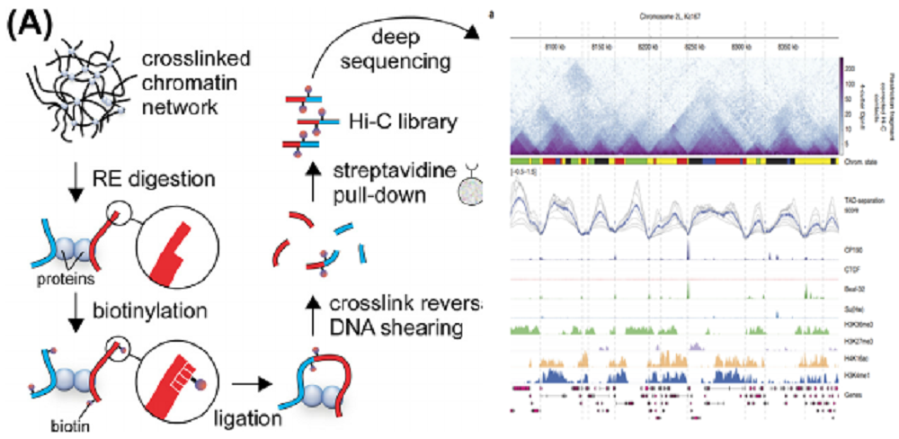

COSMOS Project
===================

----

## Ryan Pellow ##

Fidel Ramírez, Vivek Bhardwaj, Laura Arrigoni, Kin Chung Lam, Björn A. Grüning, José Villaveces, Bianca Habermann, Asifa Akhtar, and Thomas Manke. "High-resolution TADs reveal DNA sequences underlying genome organization in flies" Nature Communications, January, 15 2018, https://www.nature.com/articles/s41467-017-02525-w

Figure 1: Figure I'm going to replicate.

Figure 2: Diagram of Hi-C protocol

Sergey Ulianov, Alexey A Gavrilov, and Sergey V Razin. "Nuclear Compartments, Genome Folding, and Enhancer-Promoter Communication International review of cell and molecular biology, February 2018, DOI: 10.1016/bs.ircmb.2014.11.004

Understanding the organization of chromosomes provides insights into the regulation of genome function. Recently, the development of Hi-C allowed for the ability to study the contacts within and between chromosomes. These contacts, emphasized in Figure 2, are seen as insulator proteins (the light blue blobs) mediating DNA-DNA interactions (the red chromosome with the blue chromosome). In brief, Hi-C crosslinks DNA interactions, creates fragments via restriction enzymes, then ligates close by strands, which are subsequently sequenced to produce contacts (Figure 2). It is important to make clear that a successful contacts consists of sequences from two sections of the genome. Additionally, looking back at Figure 1, the darker shade of blue signifies more copies of that pair. This explains the overall triangle aspect, which represents chromosome subcompartments or topologically associated domains (TADs). The bottom corners of the TADs describe the location of an insulator protein (usually a hallmark of a TAD boundary), whose sequence will most likely not be cut and ligated with anything and thus the reads map only to its location. Also, a dark triangle represents an ordinary domain, whereas the darkening of only the top tip of the triangle represents a loop domain. As a clarification, TADs are broadly defined as they may contain both smaller TADs and loops. Significantly, TADs have been able to show the congregation of coregulated genes, as well as the interactions between genes and distal regulatory elements. The paper I chose sought to describe the DNA motifs that are enriched at the TAD boundaries, which by doing so would identify common insulator motifs. Note that when looking at the figure, the areas of low TAD-separation score, strive to further define a TAD boundary. When this is compounded with ChIP-seq data, the presence of the insulator protein Beaf32 and its cofactor CP190 are exemplified as expected. Interestingly, proposed insulator protein Su(Hw) had little coverage, while known mammalian insulator protein CTCF had no coverage. Finally, the paper performed ChIP-seq to demarcate between heterochromatic (H3K27me3) and euchromatic (H3K36me3, H3K16ac, H3K4me1) regions. The purpose behind choosing this paper was to use it as a proof of concept as my project in lab seeks to create similar figures to describe the effect of transposons on TADs. To replicate the following figures I will follow the following steps:

1. Download the Hi-C data from NCBI GEO-Accession: GSE97965 (has been located)
2.  Hi-C data will be processed with HiCExplorer and HiCBrowser (both available on github)
    1. Does mapping, stats and plotting
3. Download the ChIP-seq data from NCBI GEO-Accession: multiple (has been located)
4. Aligned to dm3: Bowtie2
5. Identify peaks for proteins: MACS2
6. Identify motifs: MEME-chip
    1. Various stats done throughout, depending on step
    2. Data sent to HiCExplorer to be plotted

