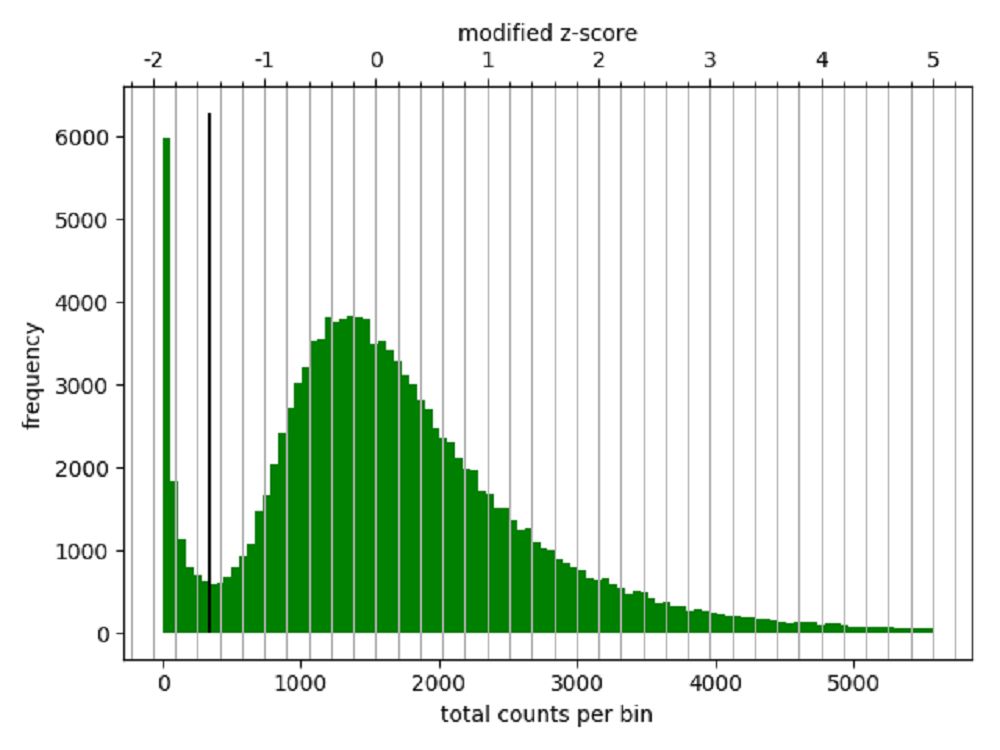
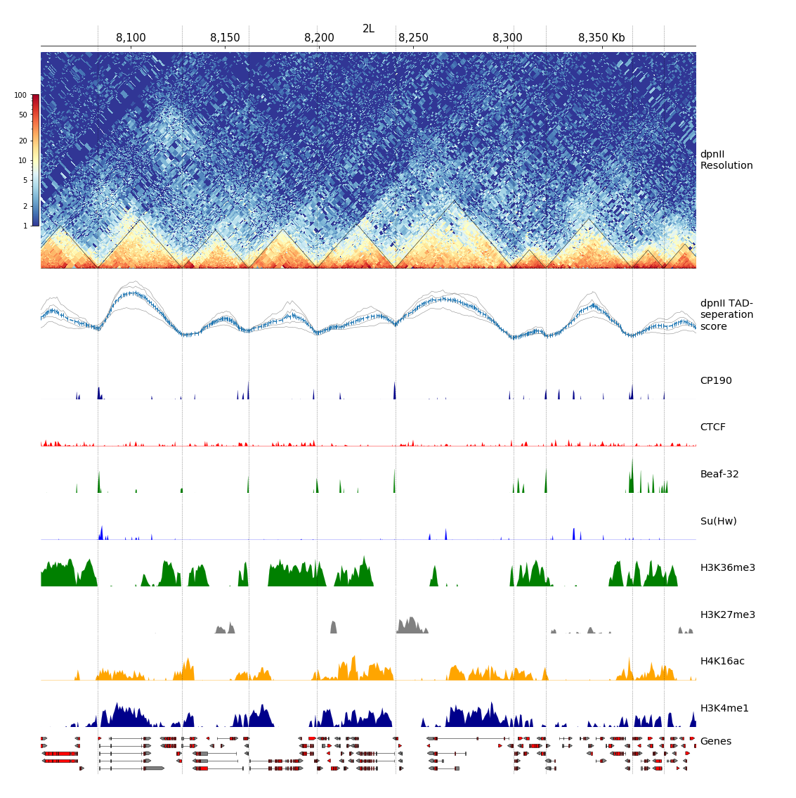

COSMOS Project
===================

----

## Ryan Pellow ##

Fidel Ramírez, Vivek Bhardwaj, Laura Arrigoni, Kin Chung Lam, Björn A. Grüning, José Villaveces, Bianca Habermann, Asifa Akhtar, and Thomas Manke. "High-resolution TADs reveal DNA sequences underlying genome organization in flies" Nature Communications, January, 15 2018, https://www.nature.com/articles/s41467-017-02525-w

Figure 1: Figure I'm going to replicate.

&nbsp;
&nbsp;
&nbsp;
&nbsp;

Figure 2: Diagram of Hi-C protocol

Sergey Ulianov, Alexey A Gavrilov, and Sergey V Razin. "Nuclear Compartments, Genome Folding, and Enhancer-Promoter Communication International review of cell and molecular biology, February 2018, DOI: 10.1016/bs.ircmb.2014.11.004

## Introduction ##

Understanding the organization of chromosomes provides insights into the regulation of genome function. Recently, the development of Hi-C allowed for the 
ability to study the contacts within and between chromosomes. These contacts, emphasized in Figure 2, are seen as insulator proteins (the light blue blobs) 
mediating DNA-DNA interactions (the red chromosome with the blue chromosome). In brief, Hi-C crosslinks DNA interactions, creates fragments via restriction 
enzymes, then ligates close by strands, which are subsequently sequenced to produce contacts (Figure 2). It is important to make clear that a successful 
contacts consists of sequences from two sections of the genome. Additionally, looking back at Figure 1, the darker shade of blue signifies more copies of that
pair. This explains the overall triangle aspect, which represents chromosome subcompartments or topologically associated domains (TADs). The bottom corners of
the TADs describe the location of an insulator protein (usually a hallmark of a TAD boundary), whose sequence will most likely not be cut and ligated with 
anything and thus the reads map only to its location. Also, a dark triangle represents an ordinary domain, whereas the darkening of only the top tip of the 
triangle represents a loop domain. As a clarification, TADs are broadly defined as they may contain both smaller TADs and loops. Significantly, TADs have been
able to show the congregation of coregulated genes, as well as the interactions between genes and distal regulatory elements. The paper I chose sought to 
describe the DNA motifs that are enriched at the TAD boundaries, which by doing so would identify common insulator motifs. Note that when looking at the 
figure, the areas of low TAD-separation score, strive to further define a TAD boundary. When this is compounded with ChIP-seq data, the presence of the 
insulator protein Beaf32 and its cofactor CP190 are exemplified as expected. Interestingly, proposed insulator protein Su(Hw) had little coverage, while known
mammalian insulator protein CTCF had no coverage. Finally, the paper used ChIP-chip data from modENCODE to demarcate between heterochromatic (H3K27me3) and 
euchromatic (H3K36me3, H3K16ac, H3K4me1) regions. The purpose behind choosing this paper was to use it as a proof of concept, as my project seeks to create 
similar figures to describe the effect of stress on TADs.

## Methods ##

### Hi-C Processing ###

The Hi-C data was downloaded from NCBI under the accession SRR3452738 using the fastq-dump --split-3 to seperate forward and reverse reads into two seperate 
files. To align the Hi-C data, bwa mem was used with a relaxed gap extension penalty (-E 50) and no clipping penalties (-L 0) in order to allow reads to map 
to distant regions in the genome. From there, HiCEplorer and co-required packages were downloaded using pip install in a virtual environment on the argon high
 performance cluster. This allowed for the bypass of root administration requirements. Subsequently the output .bam files from alignment were processed into a
.cool file using "hicBuildMatrix" with various binsizes (dpnII restriction fragment, 1kb, 5kb, 10kb), which accesses the initial contacts and provides quality
 control (images can be seen in qcfolder, but are hidden on github due to the high resolution and consequently large file size). The .cool file was then 
diagnosed using "hicCorrectMatrix dianostic_plot" (Figure 3). Based on the diagnostics, a threshold (-1.5, 5) of was chosen for the "hicCorrectMatrix correct"
command, which outputed a corrected .cool file that was then plotted using "hicPlotMatrix" (Figure 4). Finally, in order to call TADs, "hicFindTADs" was used 
to ouput .bed files containing boundary, domain and TAD seperation scores information. These were then used to build plots via "make_tracks_file" (from 
pyGenomeTracks and "hicPlotTADs". Ultimately, the last challenge will be to find more in-depth documentation for pyGenomeTracks and since the article fails to
list their parameters, there might be quite a bit of time spent exploring and tinkering.

### ChIP-seq Processing ###

The ChIP-seq data (CP190, CTCF, Beaf-32, and Su(Hw)) were individually downloaded fromNCBI using fastq-dump. The fastq files were aligned using Bowtie2 
(with an index created using "bowtie2 build" and based on dm6), with peaks being identified by MACS2 and converted to bigwig files using DeepTools2 
"bamCompare" and "bamCoverage". Finally, after processing the files were merged with the Hi-C data using "make_tracks_file" and plotted with "hicPlotTADs".

### ChIP-chip Data ###
The ChIP-chip data (H3K36me3, H3K27me3, H4K16ac and H3K4me1) were individually downloaded from modENCODE as a compressed .wig file. The each file was 
subsequently converted to a .bw file using the UCSC binary utility function "wigToBigWig". Once converted, the files were merged into a tracks file using the
"make_tracks_file" and plotted using "hicPlotTADs".

### Gene Track ###
The NCBI Refseq gene track was downloaded as a .bed file from UCSC and subsequently sorted using the bedtools function "sortBed" with default parameters. 
Lastly, the file was incorporated into a tracks file using "make_tracks_files" and plotted with "hicPlotTADs".

Figure 3: Diagnostic Plot.

Figure 4: Matrix Plot.

## Results and Discussion ##

As mentioned earlier, the parameters used to build the tracks are nonexistent, so I ended up picking the color schemes that looked similar or what I thought 
looked best. With that said, the color red represents a greater number of contacts, while the blue represents fewer contacts. The legend is also on a 
logarithmic scale. Based on the reproduced TAD plot (Figure 5), similar results can begin to be made out. The most obvious is the small TADs (dark blue in 
the original and yellow/red in mine) and the similarities in the TAD-speration score plots. Additionally, two looping structures at ~8075kb and ~8125kb can 
be seen. This dictinction can be made from TADs as they don't appear as filled triangles but more of a tip of a triangle. In order to visualize larger TADs, I
 included a resolution comparison plot to show that increasing the binsizes can lead to the visualization of larger TADs, at the cost of masking smaller ones 
(Figure 6). The one thing I was unable to reproduce was the chromatin states track. The finished track is available along with the details of the pipeline and
 histones used, but the raw histone data unavailabe. As a result, I chose to not include the pre-made track because I was unable to even attempt its 
reproduction. Finally, the ChIP-seq and ChIP-chip data turned out nearly identical in appearence to the paper, with the exception being that it appears that 
the CTCF has more noise. I believe the reason for this additional noise stems from the anaysis tool. MACS2 creates a file of discrete peak locations, whereas 
DeepTools2 create a file with peaks on a continous scale. Thus, MACS2 returned nothing for this specific region, while DeepTools2 returned noise. 
Consequently, the MACS2 file could not be plotted (returned a no peak error) while the DeepTools2 file could. With that said, my intuition is that when the 
authors recieved this error from MACS2 they simply replaced the track with a line centered at zero. Although I think the move is valid, I personally believe 
the DeepTools2 file provides a more accurate representation. However, despite this inconsistency, the reproduction seems to confirm the findings in the paper. Specifically that CTCF does not appear to play a role in TAD boundaries, regardless of chromatin state. 

Figure 5: TADs Plot.

Figure 6: Resolution Comparison Plot.

## Conclusion ##

### Helpful Robust Tools ###
* Python virtual environment within argon
	* Allowed me to download required packages without root permissions
	* Allowed for the editing of the underlying code

### Challenges with Reproducability ###
* Restriction enzyme level resolution
	* Necessary for high resolution TADs
	* Bug in the code that prevented proper functionality, was only fixed via a patched version released by authors and incorporated by hand
* make_tracks_file
	* This function has no parameters and sporatic documentation
	* Ended up manually editting the .ini file to acheive the desired formatting
* Gene tracks
	* Turns out the gene track is actually 20 tracks long, was cropped to 5
	* In a different order because I used the reference dm6 and they used dm3 
* Peak Plotting
	* MACS2 produces discrete plots
* Chromatin States Track
	* Final product is available, but data used and means are not
 

